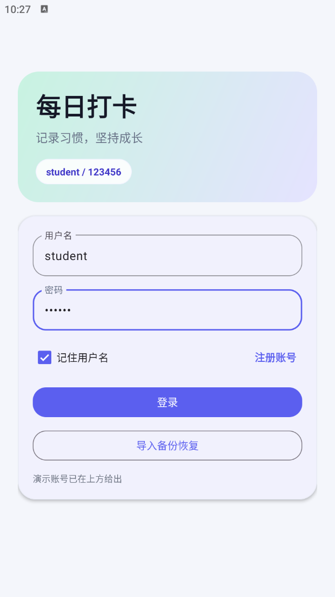
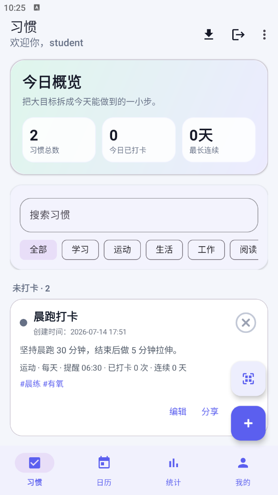
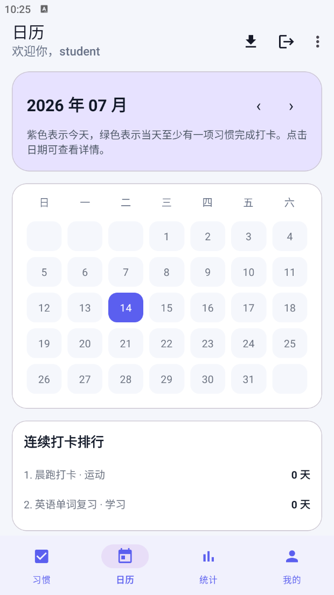
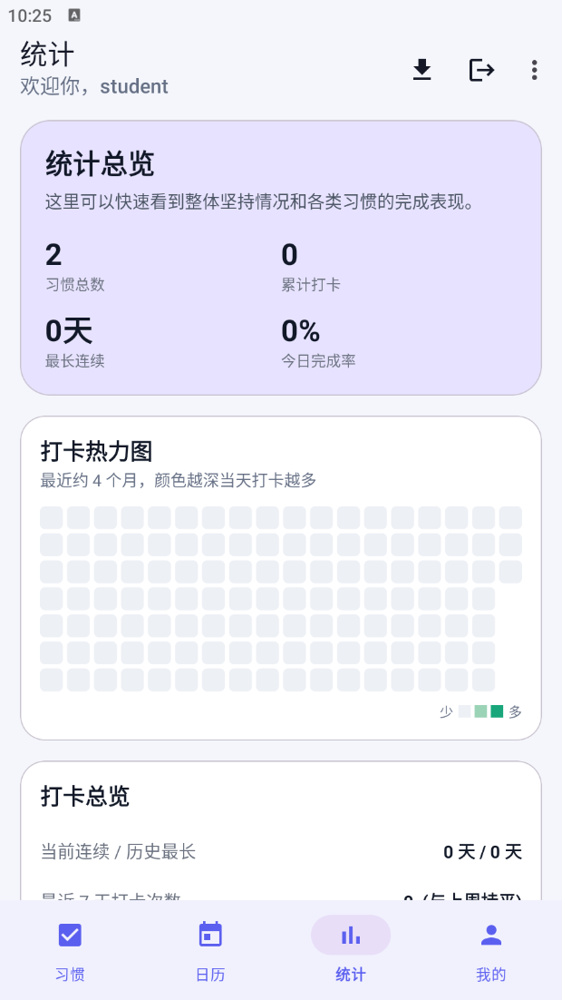
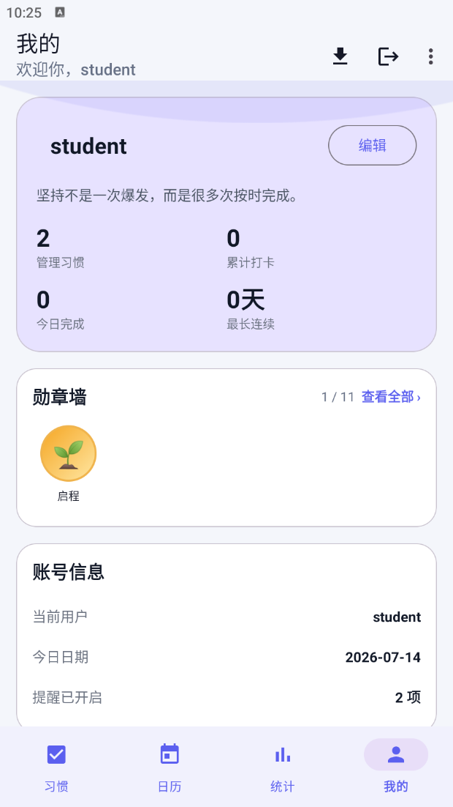
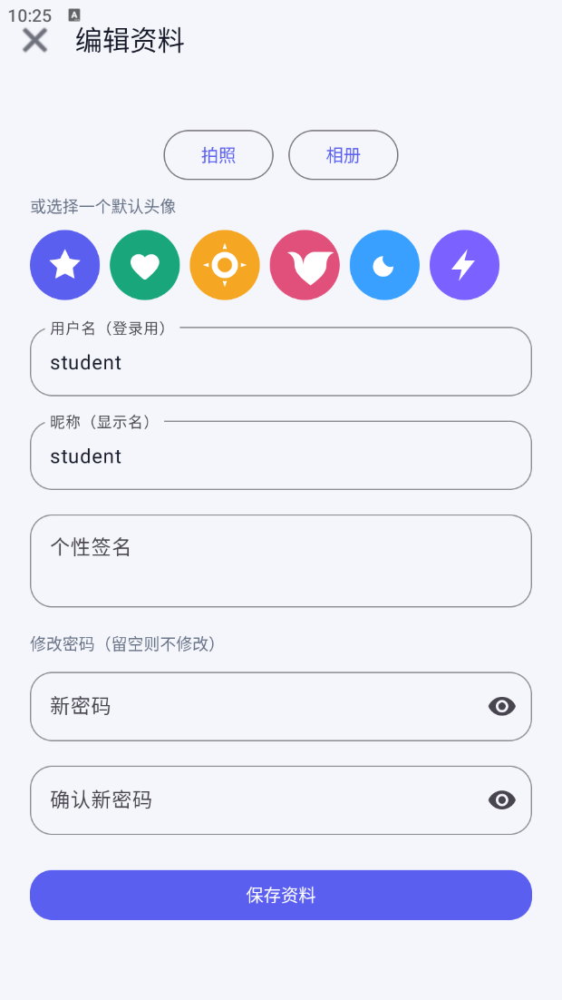
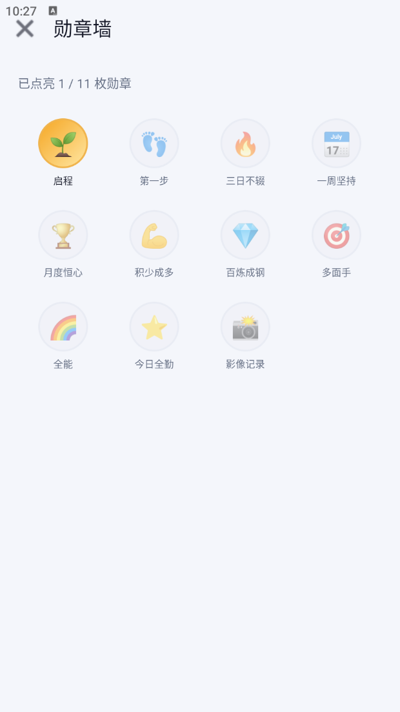
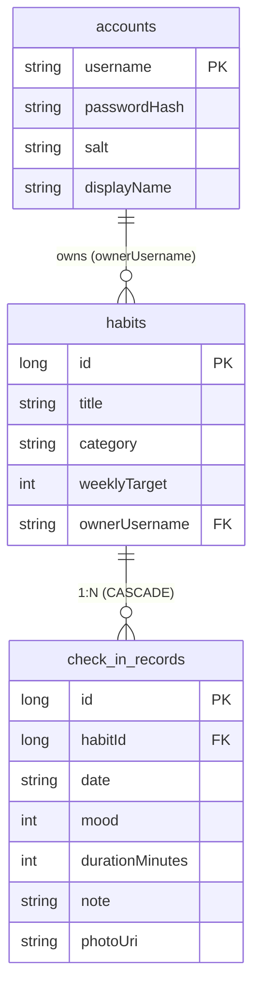

<div align="center">

# 🔥 Streak

**一款基于原生 Android（Java）的每日打卡习惯追踪应用**

本地优先 · 多账号隔离 · 规范化数据库 · 离线可用

<p>
  
  
  
  
  
  
</p>

</div>

> `Streak` 在本地完成账号管理与全部数据存储，支持习惯的增删改查、每日 / 每周打卡、连续天数统计、日历回顾、习惯详情、智能洞察、数据可视化、勋章激励、二维码分享（可保存到相册 / 从相册识别）、成就战报分享、桌面小组件、备份导入导出与定时提醒，并提供拍照／相册配图与个性化资料设置。

- 📦 项目包名：`com.streak.app`
- 🔑 内置演示账号：`student / 123456`

---

## 📑 目录

- [项目效果图](#-项目效果图)
- [技术亮点](#-技术亮点)
- [功能特性](#-功能特性)
- [技术栈](#-技术栈)
- [数据模型](#-数据模型)
- [工程结构](#-工程结构)
- [构建与运行](#-构建与运行)
- [权限说明](#-权限说明)
- [许可](#-许可)

---

## 📱 项目效果图

<table>
  <tr>
    <td></td>
    <td></td>
    <td></td>
  </tr>
  <tr>
    <td></td>
    <td></td>
    <td></td>
  </tr>
  <tr>
    <td></td>
    <td></td>
    <td></td>
  </tr>
</table>

---

## ✨ 技术亮点

> 相比一般「增删改查 + 本地存储」的作业级项目，本项目在数据建模、并发正确性与安全上做了更深入的工程实践。

| 亮点 | 说明 |
|------|------|
| 🗃️ **规范化数据库 + 版本迁移** | 打卡数据从 JSON 列拆为独立 `check_in_records` 表，与习惯构成 `1:N` 关系并通过外键 `ON DELETE CASCADE` 级联；四个数据库版本均带可测试的 Room `Migration`（`v1→v4`），`exportSchema=true` 归档历史 schema |
| 🔒 **多账号数据隔离** | 每条习惯携带 `ownerUsername` 归属；读 / 写 / 打卡 / 删除全链路按当前账号过滤，跨账号操作被守卫拒绝，杜绝越权读改他人数据 |
| ⚡ **乐观并发控制** | 习惯封面与打卡照片保存时携带「期望原值 + 是否改动」，在同一 SQL 事务内比对，若已被并发替换则**原子拒绝**，避免旧页面快照覆盖新数据 |
| 🛡️ **密码安全** | PBKDF2WithHmacSHA256（12 万次迭代 + 16 字节盐 + 常量时间比较）；绝不持久化明文密码；兼容旧明文账号并在导入 / 登录时自动转哈希 |
| 📦 **原子备份导入** | 导入采用「全量校验通过再落地」策略，信封版本校验 + 散装文件语义校验；任一环节失败则数据库与图片全部回滚，绝不留下半成品 |
| 🧱 **分层门面架构** | 1500+ 行的 `AppRepository` 按职责拆为 `data/` 下七个专职仓库，门面保持公开 API 不变；主界面由单 Activity 重构为 `DashboardActivity + 4 Fragment` |
| 🧵 **统一线程模型** | 所有磁盘 IO / 计算 / UI 回调收敛到应用级 `AppExecutors`（diskIO 单线程串行 / computation / mainThread），消除散落的 `new Thread()` |
| 🧪 **179 个单元测试** | 基于 JUnit4 + Robolectric，覆盖存储层、数据库迁移、备份保真、并发守卫、账号隔离、二维码编解码等，**本地 JVM 运行、无需真机**；lint 0 error |

---

## 🚀 功能特性

### 🔐 账号与安全
- 本地注册、登录、退出，支持「记住用户名」
- 密码采用 PBKDF2 加盐哈希存储；兼容旧明文账号并在首次登录时自动迁移
- 仅在本地记住用户名，绝不持久化明文密码（避免被 root / 备份提取）
- 每个账号只看 / 改自己的习惯与打卡记录，账号间数据严格隔离（`ownerUsername` 归属）
- 关闭系统自动备份（`allowBackup=false`），避免私有数据被云备份带走
- 删除账号会同时清除该账号的习惯、打卡记录与照片，并清空已保存的登录信息

### 📝 习惯管理
- 新增 / 编辑 / 删除习惯，支持标题、内容、分类、标签、提醒时间
- 执行周期可选「每天」或「每周 N 次」（N = 1~6），达标口径按滚动最近 7 天窗口统一计算
- 内置习惯模板，快速创建常见习惯
- 习惯列表支持按关键字搜索、按分类筛选，并按打卡状态分组展示

### ✅ 打卡与追踪
- 一键今日打卡 / 取消打卡；可为每天的打卡写下备注 / 心情
- 自动统计今日完成数、单个习惯连续打卡天数、累计打卡次数（按日期去重）
- 每周 N 次型习惯按滚动 7 天窗口判定达标，避免「已完成本周目标却仍显示未打卡」
- 日历页按月查看打卡分布，支持连续补卡

### 📊 习惯详情
- 独立详情页展示单个习惯的关键数字（当前连续 / 历史最长 / 累计打卡）
- 打卡热力图回顾长期坚持轨迹
- 星期偏好、断卡预警等分析，以及按时间线排列的打卡备注

### 🧠 智能洞察
- 基于既有打卡数据的轻量分析（`HabitAnalytics`），不引入第三方库
- 坚持排行：找出「最能坚持」与「最需要关注」的习惯（按历史最长连续天数）
- 星期偏好：统计打卡最活跃的星期几
- 断卡预警：距今连续未打卡达阈值的习惯自动提示尽快续上

### 📈 数据可视化
- 统计页展示习惯总数、累计打卡、完成率
- 分类分布饼图（自绘 `CategoryPieChart`）
- 打卡热力图（自绘 `StreakHeatmapView`）
- 周 / 月打卡量统计

### 👤 个性化资料
- 设置昵称、个性签名、头像
- 头像支持 6 款预置图案，或拍照 / 相册自定义

### 🏅 勋章墙
- 内置多枚成就勋章（创建习惯、连续打卡 3/7/30 天、累计打卡 50/100 次、全勤、影像记录等）
- 根据当前数据自动点亮，个人主页展示进度

### 🎉 成就战报分享
- 生成成就战报卡片（总成就 / 近 7 天 / 近 30 天维度可切换，`ShareCardGenerator` 绘制）
- 一键保存到相册或通过系统分享发送

### 🔗 二维码分享
- 将习惯生成二维码分享给同学（自定义 `streak-habit/v1` 协议），支持一键保存二维码到系统相册
- 扫码「加同款」习惯，扫码界面锁定竖屏，并内置从相册选图离线识别二维码
- 对扫到的二维码内容做长度上限与控制字符清洗，防止不可信输入注入编辑器

### 🧩 桌面小组件
- 桌面小组件显示今日打卡进度（已完成 / 习惯总数），点击进入 App
- 完成度按习惯周期口径计算，与列表 / 统计保持一致；App 内数据变化后主动刷新

### 💾 备份与恢复
- 一键导出 ZIP 备份（含习惯、账号资料与全部图片），通过系统分享发送
- 导入备份恢复数据；导入采用「习惯与账号先全量校验、全部通过再落地」策略，避免中途失败破坏现有数据
- ZIP 导入设置单条目 / 总解压 / 条目数上限，挡住恶意或超大压缩包撑爆内存
- 解析到损坏的数据文件时自动改名备份，绝不静默覆盖用户数据

### ⏰ 定时提醒
- 为习惯设置每日提醒，到点本地通知
- 开机后自动重建全部提醒；精确闹钟不可用时自动降级为非精确闹钟

### 🎨 界面与体验
- Material 3 风格界面，浅色视觉设计，夜间模式镜像浅色主题保持一致表现
- 全量文案提取至 `strings.xml`，无硬编码字符串
- 本地图片统一降采样加载，避免大图导致的卡顿与内存溢出

---

## 🛠️ 技术栈

| 项目 | 说明 |
|------|------|
| 开发语言 | Java 17 |
| 最低 / 目标版本 | Android 8.0 (API 26) / Android 14 (API 34) |
| 构建系统 | Gradle（Groovy DSL） |
| UI | XML 布局 + ViewBinding + Material Components 1.12.0 |
| 本地存储 | Room 2.6.1（SQLite）持久化习惯与账号 + SharedPreferences + 私有图片目录 |
| 序列化 | Gson 2.11.0（备份 ZIP 读写、Room 复杂字段 TypeConverters） |
| 二维码 | ZXing core 3.5.3 + zxing-android-embedded 4.3.0 |
| 密码安全 | PBKDF2 加盐哈希（`PasswordHasher`） |
| 单元测试 | JUnit 4 + Robolectric 4.13 + room-testing（本地 JVM 运行，无需真机） |

---

## 🗂️ 数据模型



打卡数据以 `check_in_records` 表为**唯一真相源**（`(habitId, date)` 唯一，每天一条，携带备注 / 心情 / 耗时 / 照片），与习惯是 `1:N` 关系并通过外键 `ON DELETE CASCADE` 级联；`HabitItem` 的 `completedDates` / `notes` 降级为读时聚合的内存派生视图（过渡兼容字段）。

数据库当前版本 **4**，全部迁移均有单元测试覆盖：

| 迁移 | 变更 |
|------|------|
| `v1 → v2` | 习惯表新增 `ownerUsername`，支持多账号隔离 |
| `v2 → v3` | 拆出独立打卡记录表 `check_in_records` |
| `v3 → v4` | 引入 `@Upsert` 与真正的外键级联 |

`schemas/` 保存历史 schema（`exportSchema=true`）。早期版本使用 Gson JSON 文件存储，其数据在首次启动时由 `AppRepository` 一次性搬运到 Room。

---

## 📁 工程结构

```
app/src/main/java/com/streak/app/
├── StreakApp.java  Application 入口（初始化仓库、执行器与旧数据一次性搬运）
├── db/           Room 数据库（StreakDatabase、HabitDao、UserDao、CheckInRecordDao、Converters）
├── model/        数据模型（HabitItem、CheckInRecord、UserAccount、Badge、HabitTemplate、HabitBackup、BackupEnvelope、CalendarCell、CameraCaptureInfo）
├── reminder/     提醒调度与广播接收（ReminderScheduler、BootReceiver、ReminderReceiver）
├── data/         按职责拆分的数据层（AuthRepository、UserRepository、HabitRepository、CheckInRepository、BackupService、ImageStore、ReminderManager）
├── storage/      数据仓库门面 AppRepository（保持既有公开 API，转发到 data/ 各仓库）
├── ui/           界面层：登录页 MainActivity；各 Activity（RegisterActivity、HabitEditorActivity、HabitDetailActivity、ProfileEditActivity、BadgeWallActivity、ShareReportActivity、PortraitCaptureActivity）、适配器（HabitAdapter）、自绘视图（CategoryPieChart、StreakHeatmapView、NoLaserViewfinderView）
│   └── dashboard/  仪表盘 DashboardActivity 承载四个 Fragment（HabitsFragment / CalendarFragment / StatsFragment / ProfileFragment）+ 共享 DashboardViewModel + DashboardHost 宿主接口
├── util/         工具类（AppExecutors、PasswordHasher、HabitUtils、HabitAnalytics、BadgeUtils、HabitQrCodec、QrGenerator、QrDecoder、ShareCardGenerator、ImageLoader、AvatarPresets）
└── widget/       桌面小组件（StreakWidgetProvider）

app/src/test/java/com/streak/app/       本地单元测试（存储层、迁移、备份、并发守卫、分析、二维码编解码、工具类、TypeConverters）
```

代码架构上，1500+ 行的 `AppRepository` 已按职责拆分为 `data/` 包下的七个专职类，`AppRepository` 保留为薄门面（公开 API 不变、UI 零改动）转发调用；主界面由单 Activity 多视图重构为 `DashboardActivity` + 四个 Fragment，各页通过共享 `DashboardViewModel` 只监听自己关心的数据；线程统一收敛到应用级 `AppExecutors`（diskIO / computation / mainThread）。

---

## ⚙️ 构建与运行

1. 使用 Android Studio 打开项目根目录，等待 Gradle 同步完成。
2. 连接真机或启动模拟器（Android 8.0 及以上）。
3. 运行 `app` 模块。

命令行构建：

```bash
./gradlew assembleDebug      # macOS / Linux
gradlew.bat assembleDebug    # Windows
```

运行单元测试：

```bash
./gradlew testDebugUnitTest
```

产物路径：`app/build/outputs/apk/debug/app-debug.apk`

Release 签名凭据从版本库外读取（根目录 `keystore.properties`，已被忽略，可参考 `keystore.properties.template`），或回退到环境变量；凭据齐全才启用 release 签名，否则输出未签名包。

---

## 🔑 权限说明

| 权限 | 用途 |
|------|------|
| `CAMERA` | 拍照配图、扫码 |
| `POST_NOTIFICATIONS` | 习惯提醒通知 |
| `SCHEDULE_EXACT_ALARM` | 精确定时提醒（不可用时自动降级） |
| `RECEIVE_BOOT_COMPLETED` | 开机后重建提醒 |
| `WRITE_EXTERNAL_STORAGE` | 保存二维码 / 战报到相册（仅 Android 9 / API 28 及以下；API 29+ 走 MediaStore 免此权限） |

---

## 📄 许可

本项目用于课程作业 / 学习演示。
